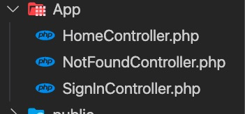
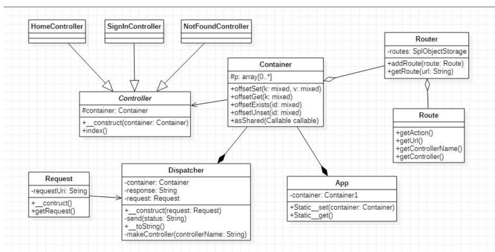

## My Simple FrameWork
Le but de ce framework est de pouvoir gérer dynamiquement les pages affichées à l’utilisateur quand il accède à une url.

### Methode d’ajout de page:
1.Ajoutez un Controller dans le dossier App



2.Dans le fichier app.php a la racine, ajouter au container la route (url, controller associé) au container.

```php
$router->addRoute(new Route(url: 'signIn', controllerName: 'SignInController'));
```

3.Ajouter Ensuite la fonction anonyme qui sera appelé dans le controller, à l’intérieur du container.
```php
$container['form.signIn'] = function ($c) {
    $signInForm = new Form(name: 'signInUser', action: '/user');
    $inputName = new Input(name: 'name', type: 'text');
    $labelName = new Label('Nom', $inputName);

    $inputPassword = new Input(name: 'password', type: 'password');
    $labelPassword = new Label('Mot de passe', $inputPassword);

    $infosWrapper = new Wrapper;
    $infosWrapper->add($labelName);
    $infosWrapper->add($labelPassword);

    $inputButton = new Input(name: 'submit', value: 'Envoyer', type: 'submit');

    $submitBtnWrapper = new Wrapper;
    $submitBtnWrapper->add($inputButton);

    $signInForm->add($infosWrapper);
    $signInForm->add($submitBtnWrapper);

    return $signInForm;
};
```

### Diagram de class du framework:



Pour ce projet nous avons utilisé plusieurs design patterncomme par exemple:

* Composite:pour créer le formulaire.
* Decorator:pour habiller les imputs avec un label.
 
 
Les transitions entre les pages sont faites par un dispatcher qui en fonction de la requête du client retrouve la Route et instancie le bon Controller.
Il appel sur celui-ci (par défaut la methode index) la méthode enregistré dans le container.
Le Controlleur envoie ensuite la réponse sous forme de vue. 